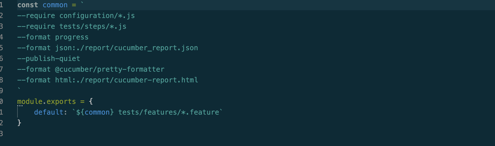

# Implementation of Cucumber with playwright JavaScript
This is an BDD (Behaviour Driven Development) automation framework that can execute scenarios with Cucumber runner and Playwright. Here We implement the Basic Playwright with Cucumber JS without following page object model.

## Install Dependencies
```
npm install
```
>N.B its safe to use node >=18 ( On some machines Node version below 18 is not working)
## General Declarations

If one clone the repo, there is a folder structure like this below,


One can easily change the folder structure based on needs.

### cucumber.conf.js
In this framework we use cucumber runner to execute the test scripts. cucumber.conf.js file is kept inside the configuration folder. This file mainly contains the all the required Hooks from cucumber. It also contains global setup and teardown functions in order to keep the codebase simple. Generally we use only the chrome browser but One can easily use different browsers as well.


### Features
Inside the features folder, we will store our feature file. We need to save it with .feature extension. We will write our scenarios here.


### Steps
Inside the steps folder, we will store our steps.js files. We will write our js codes that will validate feature statements.


### cucumber.js
In this file we kept all the required directories and paths for both the feature and steps file. If anyone wants change the folder structure, then this file will also need the updated path of the feature and steps file.



## Execute The tests

To run all the features
```
npm test
```
To run single feature file
```
npm test {feature name}
```
To run single scneario
```
npm test ${tagName}
```

## References
* [Playwright](https://playwright.dev/docs/library) - Driver Library
* [Cucumber](https://www.npmjs.com/package/@cucumber/cucumber) - BDD Framework
* [Assertions](https://playwright.dev/docs/test-assertions) - Playwright Assertion Library
* [Prettier](https://www.npmjs.com/package/@cucumber/pretty-formatter) - Cucumber formatter
